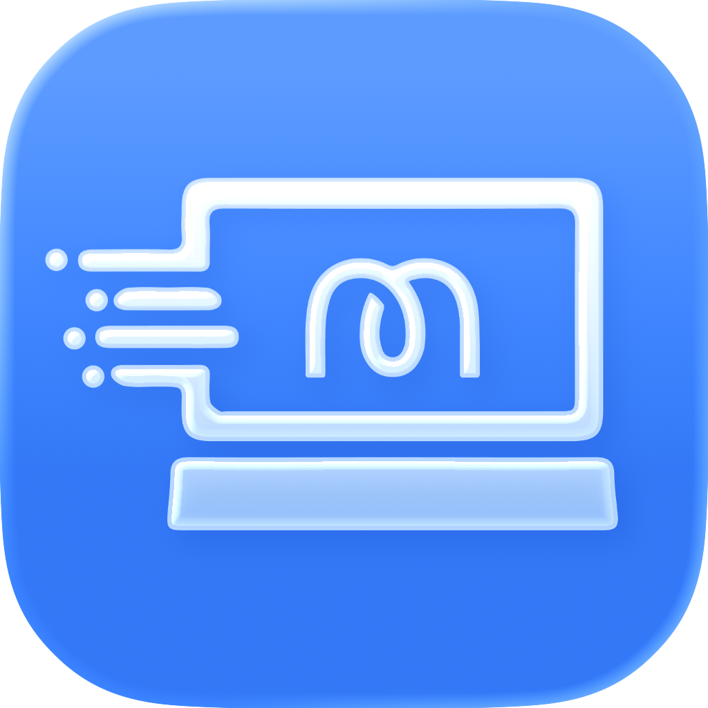

<div id="top"></div>

‎<h1 align="center">[![GPLv3 License][license-shield]][license-url]
</h1>


<!-- PROJECT LOGO -->
<br />
<div align="center">
  <a href="https://github.com/maclub-net/MaClub">
    
  </a>

  <h3 align="center">Mac俱乐部</h3>

  <p align="center">
    基于PlayCover二次开发的iOS应用和游戏运行工具，支持Apple Silicon Macs，提供鼠标、键盘和控制器支持。
    <br />
    <br />
  </p>
</div>

<!-- ABOUT THE PROJECT -->
## 关于项目

Mac俱乐部是基于PlayCover二次开发的软件，允许在运行macOS 12.0或更新版本的Apple Silicon设备上运行iOS应用和游戏。

本项目遵循GPLv3开源协议，基于原始PlayCover项目进行开发和改进。


<p align="right"><a href="#top">⬆️ Back to top️</a></p>

<!-- GETTING STARTED -->
## Getting Started

Follow the instructions below to get Genshin Impact, and many other games, up and running in no time.

### Prerequisites

At the moment, PlayCover can only run on Apple Silicon Macs. This means that only devices with M-series SoCs (eg. M1) are supported.

If you have an Intel Mac, you can explore alternatives like Bootcamp or emulators.

### Download

You can download stable releases [here](https://github.com/PlayCover/PlayCover/releases), or build from source by following the instructions in the Documentation.

### Documentation

To learn how to setup and use PlayCover, visit the documentation [here](https://playcover.github.io/PlayBook).

### Homebrew Cask
We host a [Homebrew](https://brew.sh) tap with the [PlayCover cask](https://github.com/PlayCover/homebrew-playcover/blob/master/Casks/playcover-community.rb). To install from it run:

```sh
brew install --cask PlayCover/playcover/playcover-community
```

To uninstall:
1. Remove PlayCover using `brew uninstall --cask playcover-community`;
2. Untap `PlayCover/playcover` with `brew untap PlayCover/playcover`.

<p align="right"><a href="#top">⬆️ Back to top️</a></p>


<!-- LICENSE -->
## License

Distributed under the GPLv3 License. See `LICENSE` for more information.


<!-- CONTACT -->
## Contact

Lucas Lee - playcover@lucas.icu

Depal - depal@playcover.io


<!-- ACKNOWLEDGMENTS -->
## Libraries Used

These open source libraries were used to create this project.

* [inject](https://github.com/paradiseduo/inject)
* [PTFakeTouch](https://github.com/Ret70/PTFakeTouch)
* [DownloadManager](https://github.com/shapedbyiris/download-manager)
* [DataCache](https://github.com/huynguyencong/DataCache)
* [SwiftUI CachedAsyncImage](https://github.com/bullinnyc/CachedAsyncImage)

* Thanks to @iVoider for creating such a great project!

<p align="right"><a href="#top">⬆️ Back to top️</a></p>


<!-- MARKDOWN LINKS & IMAGES -->
[contributors-shield]: https://img.shields.io/github/contributors/PlayCover/PlayCover.svg?style=for-the-badge
[contributors-url]: https://github.com/PlayCover/PlayCover/graphs/contributors
[forks-shield]: https://img.shields.io/github/forks/PlayCover/PlayCover.svg?style=for-the-badge
[forks-url]: https://github.com/PlayCover/PlayCover/network/members
[stars-shield]: https://img.shields.io/github/stars/PlayCover/PlayCover.svg?style=for-the-badge
[stars-url]: https://github.com/PlayCover/PlayCover/stargazers
[issues-shield]: https://img.shields.io/github/issues/PlayCover/PlayCover.svg?style=for-the-badge
[issues-url]: https://github.com/PlayCover/PlayCover/issues
[license-shield]: https://img.shields.io/github/license/PlayCover/PlayCover.svg?style=for-the-badge
[license-url]: https://github.com/PlayCover/PlayCover/blob/master/LICENSE
